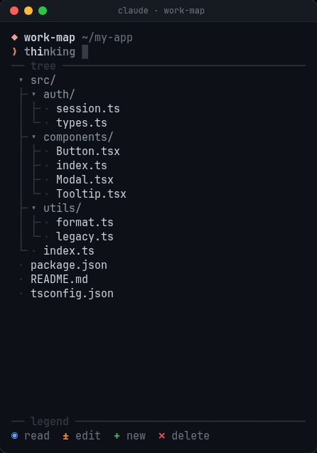
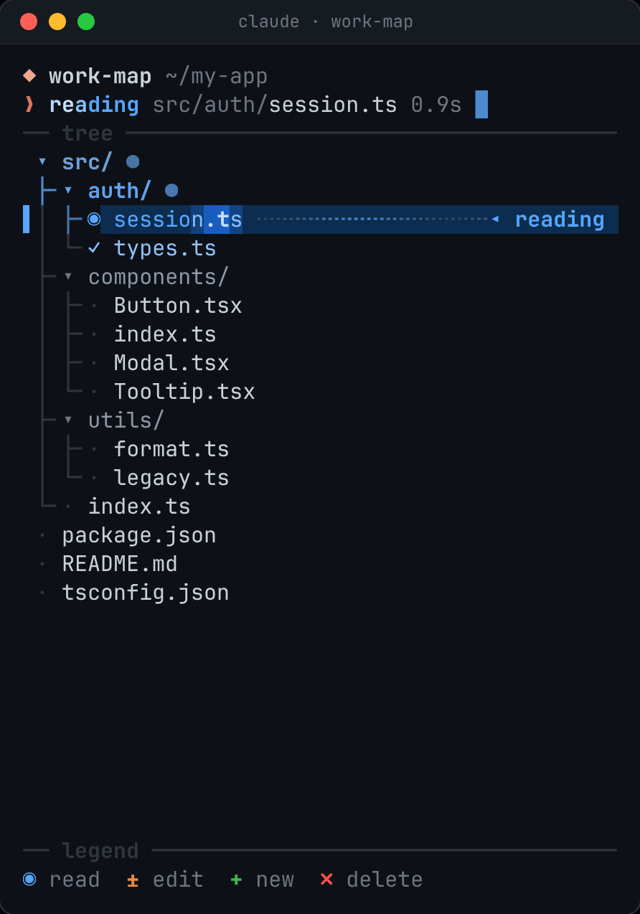
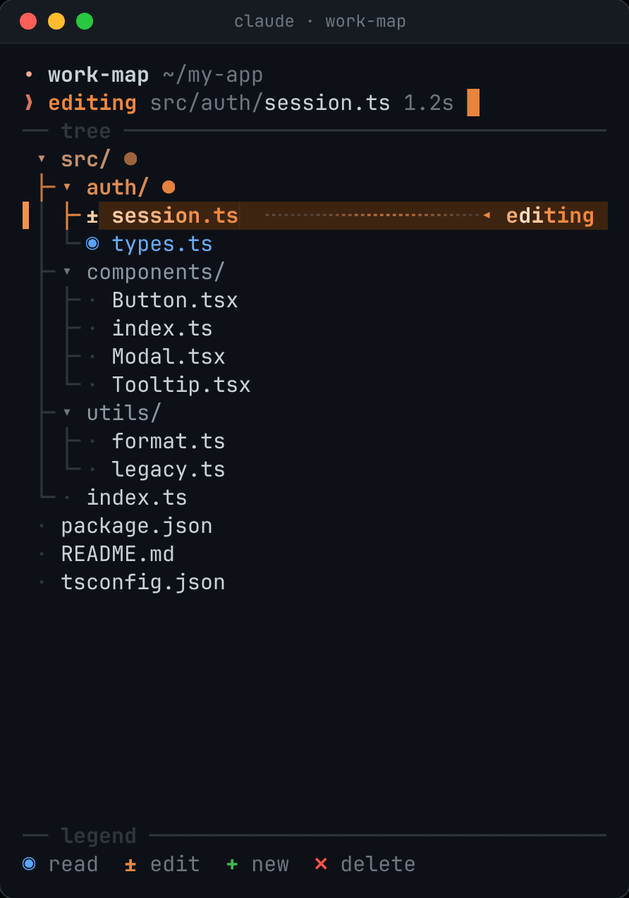
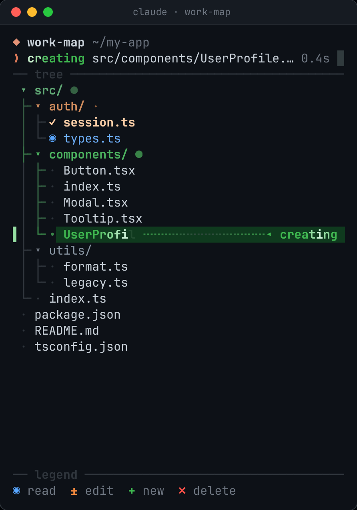
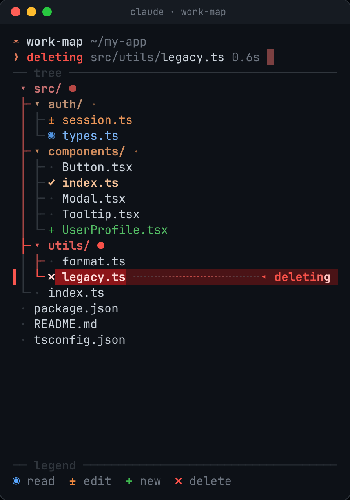
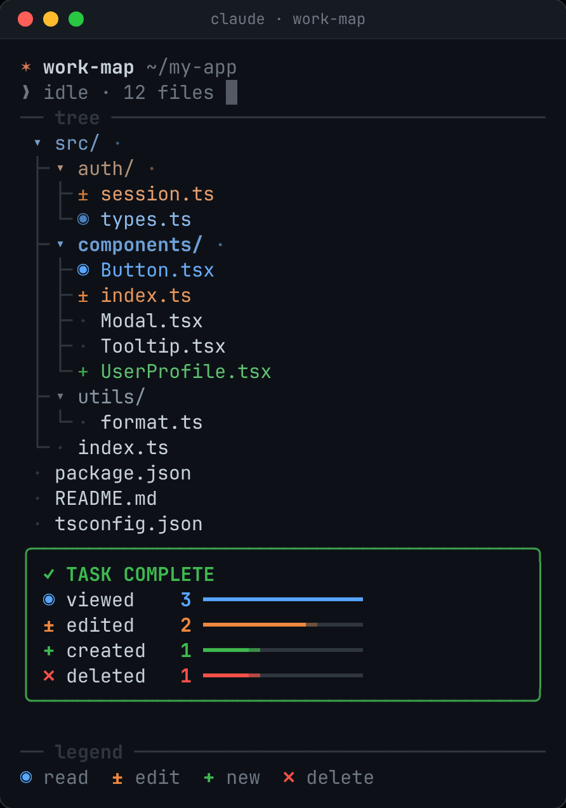

# Claude Work Visualized

A Claude Code mod that turns Claude's file operations into a **live, animated map of your project**.
A sidebar pane shows the project tree and animates every file as Claude reads, edits, creates or
deletes it, so you can see at a glance where Claude is working right now.

<p align="center">
  
</p>

## Features

- **Live file tree:** the project is scanned when the session starts and rescanned every 1.5 s, so
  changes made by scripts, builds or your editor show up too.
- **One look per operation:** each of read, edit, create and delete has its own colour, glyph and
  animation, so you can tell them apart without reading labels.
- **Current file:** the file Claude is on right now gets the strongest animation, a `▌` marker, a
  tinted row and a `◂ editing` label.
- **Path to the current file:** the tree guides and parent folders light up along the way down
  to it, weaker the further up they are.
- **Fading trail:** files Claude has touched stay marked and fade back to normal over about 60 s.
- **Prompt line:** shows what Claude is doing, on which path, for how long, with a blinking
  cursor.
- **Completion card:** when a turn ends, a card shows how many files were viewed, edited, created
  and deleted, as filling bars.
- **Terminal style:** only one-cell glyphs and box-drawing characters, up to 30 fps while anything
  moves, and idle when nothing does.

## Usage

| Command | What it does |
| --- | --- |
| `/watch` | Turns the work map on or off (opens or closes the pane). The choice is remembered across sessions. |

- When it's on, the pane opens by itself at session start once the terminal is at least 144
  columns wide. `/watch` opens it at any width.
- Closing the pane by hand also turns watching off. The next `/watch` reopens it.
- While a tool runs, the status line also shows the current operation, e.g. `± edit src/app.ts`.

## Visual language

| Glyph | Operation | Colour | While running | After |
| --- | --- | --- | --- | --- |
| `◉` | read | blue | a band of light sweeps across the name | `✓`, colour fades |
| `±` | edit | orange | a ripple runs along the name, then a blinking cursor `▏` | `✓`, colour fades |
| `+` | create | green | the name types itself in, then glows | settles into the tree |
| `✗` | delete | red | red pulse | highlight → damped shake → removed letter by letter |

<table>
  <tr>
    <td align="center"><br><sub><b>Reading</b>: the scan band sweeps the name</sub></td>
    <td align="center"><br><sub><b>Editing</b>: ripple, cursor and lit path</sub></td>
  </tr>
  <tr>
    <td align="center"><br><sub><b>Creating</b>: the name types itself in</sub></td>
    <td align="center"><br><sub><b>Deleting</b>: red pulse, then shake and dissolve</sub></td>
  </tr>
  <tr>
    <td align="center" colspan="2"><br><sub><b>Task complete</b>: the trail of the turn and its summary</sub></td>
  </tr>
</table>

<sub>The GIF and screenshots are rendered from the plugin's own drawing code (`hooks/model.ts`) by
[`scripts/render-media.mjs`](scripts/render-media.mjs), so they show exactly what the pane draws,
frame by frame.</sub>

See [docs/visual-language.md](docs/visual-language.md) for the full timelines and colours.

## Installation

### Requirements

- [Claude Code](https://claude.com/claude-code) with function-hooks plugins, tested on **2.1.288**. The
  function-hooks API is in early access and may change between releases.
- A terminal at least **144 columns wide** for the pane to open on its own as a sidebar. It opens
  at any width with `/watch`.
- A dark terminal theme is recommended; the colours are tuned for one.

### Option 1: install from the marketplace (recommended)

This repository is also a Claude Code plugin marketplace. Inside Claude Code, run:

```
/plugin marketplace add GrzeskoByte/claude-work-visualized
/plugin install work-visualized@claude-work-visualized
```

Or from your shell:

```sh
claude plugin marketplace add GrzeskoByte/claude-work-visualized
claude plugin install work-visualized@claude-work-visualized
```

Restart Claude Code (or start a new session) and the work map loads. Run `/watch` if the pane
doesn't open by itself.

To update to the latest version:

```sh
claude plugin marketplace update claude-work-visualized
claude plugin update work-visualized@claude-work-visualized
```

To remove it:

```sh
claude plugin uninstall work-visualized@claude-work-visualized
claude plugin marketplace remove claude-work-visualized
```

### Option 2: run from a local clone

Useful for trying it once or for working on the mod itself:

```sh
git clone https://github.com/GrzeskoByte/claude-work-visualized.git
claude --plugin-dir ./claude-work-visualized
```

`--plugin-dir` loads the plugin for that session only, and reloads it whenever you save a file. To
load it in every session without installing it, add the folder's absolute path to
`CLAUDE_CODE_PLUGIN_DIRS`, either in your environment or in the `env` block of
`~/.claude/settings.json`:

```json
{
  "env": {
    "CLAUDE_CODE_PLUGIN_DIRS": "/home/you/claude-work-visualized"
  }
}
```

### Check that it works

1. Start Claude Code in any project and run `/watch`. The pane should show
   `✶ work-map ~/<your project>` and the project tree.
2. Ask Claude to read or edit a file. That file should light up as Claude works on it.

If nothing appears, start Claude Code with `claude --debug`. The debug log names the plugin and the
reason whenever a hook fails or the module doesn't load.

## Project layout

```
claude-work-visualized/
├── .claude-plugin/
│   ├── plugin.json              plugin manifest
│   └── marketplace.json         lets the repo be added as a marketplace
├── hooks/
│   ├── hooks.json               names the hooks module
│   ├── register.tsx             hooks: tool calls, scanning, /watch, timers, the pane
│   ├── model.ts                 pure logic: command parsing, scan diffs, the animation engine
│   └── work.test.tsx            tests
├── types/index.d.ts             types for the data the mod keeps in session state
├── docs/                        documentation
│   └── media/                   README screenshots and GIF
├── scripts/render-media.mjs     renders docs/media from the drawing code
├── LICENSE
└── README.md
```

## Documentation

- [Architecture](docs/architecture.md): how tool calls become animations
- [Visual language](docs/visual-language.md): glyphs, colours and every timeline
- [Development](docs/development.md): testing, type-checking and changing the mod

## Limitations

- **Shell commands:** files touched by `rm`, `mv`, `cp`, `touch`, `mkdir`, `cat`, `sed -i`, `>`
  and similar are recognised by reading the command text. Anything else is caught by the rescan
  after the command and shown as finished, without a "running" phase.
- **Changes made outside Claude:** they show up too, animated as if Claude had made them.
- **Skipped folders:** `node_modules`, `.git`, `dist`, `build`, caches and virtual environments
  are left out of the tree.
- **Size limit:** a scan covers at most 2,000 entries, 12 levels deep.
- **Colours:** tuned for dark terminal themes.

## License

[MIT](LICENSE) © 2026 Grzegorz Sierocki
